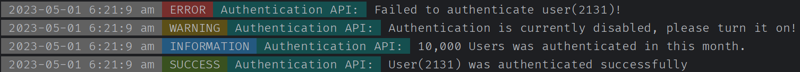

# AR-Logger Golang PKG.

AR-Logger package for Golang was created by `ABDO-AR` the creator & administrator of **AR-TEAM** & the owner 
of **AR-Company**, this package was created to provide a better logging system in `Golang` with modern & beautiful CLI
log messages as well as easy to debug & understand the application, also its support saving logs into a log file
with `JSON` syntax so that it can be used as API for the application administration panel or used directly by the 
developers for better debugging their application.

#### Run This CLI Command For The Installation

```shell
go get -u github.com/ABDO-AR/ar_logger@v1.0.1
```

#### Example of using AR-Logger

```go
package main

import "ar_logger/logger"

// Main:
func main() {
	// Setup:
	logger.SetupLoggingSystem("./logs/logs.json") // Pass empty string will make it log into "./logs.json".
	// Logging:
	logger.E("Authentication API", "Failed to authenticate user(2131)!")
	logger.W("Authentication API", "Authentication is currently disabled, please turn it on!")
	logger.I("Authentication API", "10,000 Users was authenticated in this month.")
	logger.S("Authentication API", "User(2131) was authenticated successfully")
}
```

#### OUTPUT

